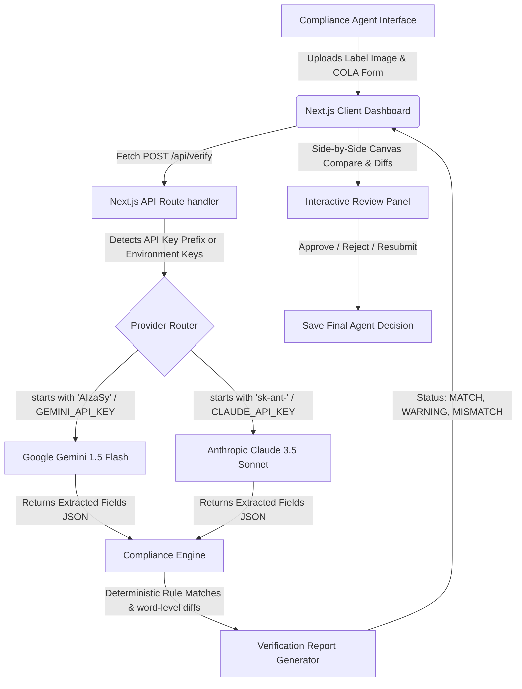

# AI-Powered Alcohol Label Verification Portal (TTB Compliance Prototype)

An interactive, serverless prototype designed for TTB (Alcohol and Tobacco Tax and Trade Bureau) compliance agents to automate label verification against COLA (Certification/Exemption of Label/Bottle Approval) applications. 

This standalone proof-of-concept leverages **Google Gemini 1.5 Flash** or **Anthropic Claude 3.5 Sonnet** for high-fidelity visual OCR text extraction, paired with a deterministic Javascript verification engine for legal rule matching.

---

## 1. Technical Architecture & System Flow

The diagram below demonstrates how data flows from the user interface, through the Next.js backend, routes to the corresponding LLM provider, and processes audits inside the custom compliance rules engine:



---

## 2. Setup & Installation

### Prerequisites
*   [Node.js](https://nodejs.org/) (v18.x or v20.x recommended)
*   An active **Google Gemini API Key** or **Anthropic Claude API Key**

### Local Run Steps
1.  **Clone or Open the Repository**:
    Navigate to the project directory:
    ```bash
    cd Treasurytakehome-rgb/label-verification
    ```

2.  **Install Dependencies**:
    ```bash
    npm install
    ```

3.  **Configure Environment Variables**:
    Create a `.env.local` file inside the `label-verification/` directory:
    ```bash
    cp .env.example .env.local
    ```
    Open `.env.local` and fill in either your Gemini key or Claude key:
    ```env
    GEMINI_API_KEY=AIzaSy...
    # OR
    CLAUDE_API_KEY=sk-ant-...
    ```

4.  **Start the Server**:
    ```bash
    npm run dev
    ```
    Open your browser and navigate to **[http://localhost:3000](http://localhost:3000)**.

---

## 3. Environment Variables Configuration

The application is built to be highly flexible. You can provide your API keys in two different ways:

1.  **Server-Side Environment File (`.env.local`)**:
    *   Set `GEMINI_API_KEY` (starts with `AIzaSy...`) OR `CLAUDE_API_KEY` (starts with `sk-ant-...`) inside `label-verification/.env.local`.
    *   When the user runs verification, the backend automatically uses these keys.
2.  **Client-Side UI Settings Panel**:
    *   Paste your key directly into the **API Settings** input field in the browser UI and click **Save Key**.
    *   The key is stored in your browser's local cache (`localStorage`) and overrides server environment variables for quick debugging.

---

## 4. Current Status & What is Remaining

The project is currently in the **Refinement & Testing** phase.

### **Implemented Features:**
*   **API Verification Route** supporting dual Gemini & Claude endpoints with base64 image encoding.
*   **Single Label Verification Dashboard** with side-by-side comparative canvas, interactive label modifications, character-diff viewer (LCS-based), and Agent Decision buttons.
*   **Batch Verification Queue Layout** supporting client-side concurrency control (up to 3 parallel workers), progress tracking, and collapsible item reports.
*   **Deterministic Compliance Rules** covering exact brand names, partial matches, custom alcohol content (ABV/Proof) regex parses, and strict case-sensitive checks for Surgeon General warning statements.

### **What is Left to Implement:**
1.  **Batch Custom Files Expansion (Phase 4)**:
    *   Currently, the Batch Importer operates on 5 pre-generated mock cases representing compliance edge cases.
    *   *Remaining:* Build the custom multi-file image upload field and the CSV parser to map COLA applications to uploaded label files by filename index.
2.  **Accessibility (a11y) Audits (Phase 5)**:
    *   *Remaining:* Audit color-contrast ratios, focus states, and keyboard navigability to support older agents (the 50+ demographic).
3.  **Documentation (Phase 6)**:
    *   *Remaining:* Finalize deployment guidelines for hosting platforms (e.g. Vercel, Azure App Service, or Firebase App Hosting).
