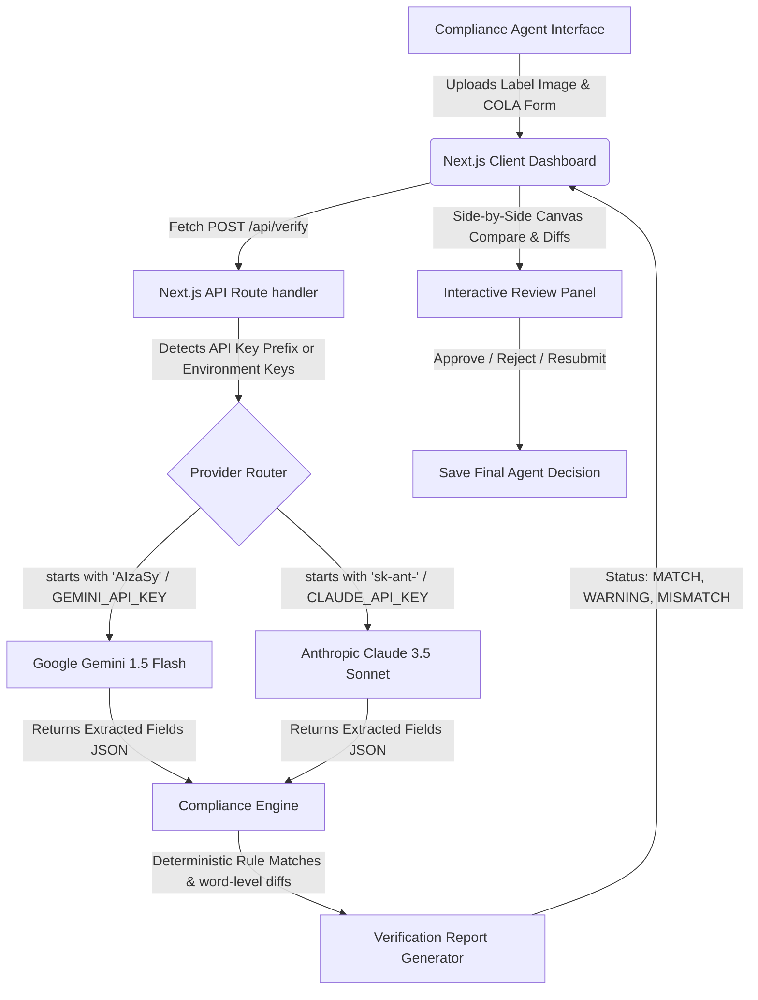

# AI-Powered Alcohol Label Verification Portal (TTB Compliance Prototype)

An interactive, serverless prototype designed for TTB (Alcohol and Tobacco Tax and Trade Bureau) compliance agents to automate label verification against COLA (Certification/Exemption of Label/Bottle Approval) applications. 

This standalone proof-of-concept leverages **Google Gemini 1.5 Flash** or **Anthropic Claude 3.5 Sonnet** for high-fidelity visual OCR text extraction, paired with a deterministic Javascript verification engine for legal rule matching.

---

## 1. Technical Architecture & System Flow

The diagram below demonstrates how data flows from the user interface, through the Next.js backend, routes to the corresponding LLM provider, and processes audits inside the custom compliance rules engine:



---

## 2. Setup & Installation

### Prerequisites
*   [Node.js](https://nodejs.org/) (v18.x or v20.x recommended)
*   An active **Google Gemini API Key** or **Anthropic Claude API Key**

### Local Run Steps
1.  **Clone or Open the Repository**:
    Navigate to the project directory:
    ```bash
    cd Treasurytakehome-rgb/label-verification
    ```

2.  **Install Dependencies**:
    ```bash
    npm install
    ```

3.  **Configure Environment Variables**:
    Create a `.env.local` file inside the `label-verification/` directory:
    ```bash
    cp .env.example .env.local
    ```
    Open `.env.local` and fill in either your Gemini key or Claude key:
    ```env
    GEMINI_API_KEY=AIzaSy...
    # OR
    CLAUDE_API_KEY=sk-ant-...
    ```

4.  **Start the Server**:
    ```bash
    npm run dev
    ```
    Open your browser and navigate to **[http://localhost:3000](http://localhost:3000)**.

---

## 3. Environment Variables Configuration

The application is built to be highly flexible. You can provide your API keys in two different ways:

1.  **Server-Side Environment File (`.env.local`)**:
    *   Set `GEMINI_API_KEY` (starts with `AIzaSy...`) OR `CLAUDE_API_KEY` (starts with `sk-ant-...`) inside `label-verification/.env.local`.
    *   When the user runs verification, the backend automatically uses these keys.
2.  **Client-Side UI Settings Panel**:
    *   Paste your key directly into the **API Settings** input field in the browser UI and click **Save Key**.
    *   The key is stored in your browser's local cache (`localStorage`) and overrides server environment variables for quick debugging.

---

## 4. Current Status & Verification Summary

The project has achieved **100% completion of the functional requirements**.

### **Completed Features:**
*   **API Verification Route**: Integrates both Google Gemini 1.5 Flash and Anthropic Claude 3.5 Sonnet endpoints, supporting direct image base64 inputs.
*   **Single Label Verification Dashboard**: Features visual HTML5 comparative canvas, real-time label text editing, word-level Longest Common Subsequence (LCS) diff viewer, and an Agent Decision panel.
*   **Batch Verification Dashboard**: Support for **custom multi-image uploader** and a **CSV file mapper**. Includes a client-side parallel processing queue with custom concurrency control (1, 2, or 3 parallel workers), progress tracking, statistics, and diagnostic alerts for missing files. Includes a "Download CSV Template" option for format alignment.
*   **Compliance Rules Engine**: Handles custom ABV regex parsing (percentage and proof conversion), net contents spacing tolerance, brand matches, and strict word-for-word and casing checks for Surgeon General warning statements.
*   **Accessibility (a11y) Focus**: Integrated high-contrast `:focus-visible` indicators for buttons, inputs, select selectors, and textareas to support keyboard-only navigability for older agents (the 50+ demographic).

---

## 5. Production Deployment Guide

Since this Next.js app is built on App Router and uses serverless API routes, it can be deployed to standard cloud platforms:

### Option A: Vercel (Recommended)
1. Install Vercel CLI: `npm i -g vercel`
2. Run `vercel` in the project root (`label-verification/` directory).
3. Follow the interactive prompts to link your project.
4. Set the Environment Variables when prompted or inside the Vercel Dashboard:
   * `GEMINI_API_KEY`
   * `CLAUDE_API_KEY`
5. Run `vercel --prod` to deploy to production.

### Option B: Firebase App Hosting
Firebase App Hosting automatically builds and manages your Next.js application backend.
1. Initialize Firebase: `npx firebase-tools init apphosting` (run inside `label-verification/`).
2. Select your Firebase project and name your web app.
3. Configure your API secret keys in GCP Secret Manager and map them in your `apphosting.yaml` configuration file:
   ```yaml
   env:
     - variable: GEMINI_API_KEY
       secret: GEMINI_API_KEY_SECRET
   ```
4. Commit and push your code to GitHub; Firebase App Hosting will automatically trigger a rolling deployment.

### Option C: Azure App Service (NodeJS Linux)
Since the production COLA and agency infrastructure is Azure-based (as noted by Marcus), deploying to Azure App Service is a natural staging solution:
1. Initialize Azure CLI and login: `az login`
2. Create an App Service Plan and Web App:
   ```bash
   az webapp up --name ttb-compliance-portal --resource-group ttb-rg --plan ttb-plan --runtime "NODE|20-lts"
   ```
3. Set app settings for API keys:
   ```bash
   az webapp config appsettings set --name ttb-compliance-portal --resource-group ttb-rg --settings GEMINI_API_KEY="AIza..." CLAUDE_API_KEY="sk-ant-..."
   ```
4. Azure will build the application using Oryx and run the production server.
