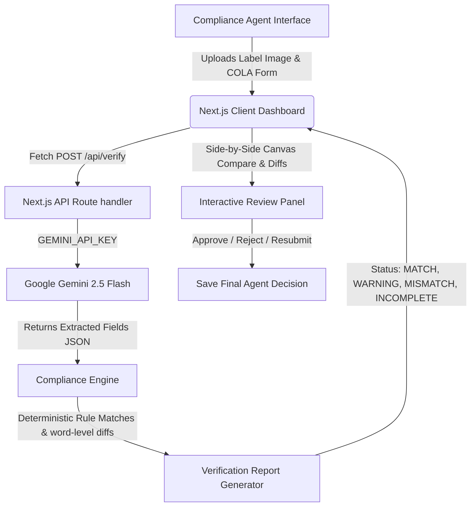

# AI-Powered Alcohol Label Verification Portal (TTB Compliance Prototype)

An interactive, serverless prototype designed for TTB (Alcohol and Tobacco Tax and Trade Bureau) compliance agents to automate label verification against COLA (Certification/Exemption of Label/Bottle Approval) applications. 

This standalone proof-of-concept leverages **Google Gemini 2.5 Flash** for high-fidelity visual OCR text extraction, paired with a deterministic Javascript verification engine for legal rule matching.

### 🔗 Live Demo
**[https://treasury-take-home-exam.vercel.app](https://treasury-take-home-exam.vercel.app)**

Deployed on Vercel with a server-side Gemini API key — no setup required to try it. Use the **Single Application review** tab (load a preset and press Verify) or the **Batch importer queue** tab (upload a CSV + label images).

---

## 1. Technical Architecture & System Flow

The diagram below demonstrates how data flows from the user interface, through the Next.js backend, to the LLM provider, and processes audits inside the custom compliance rules engine:



---

## 2. Setup & Installation

### Prerequisites
*   [Node.js](https://nodejs.org/) (v18.x or v20.x recommended)
*   An active **Google Gemini API Key**

### Local Run Steps
1.  **Clone or Open the Repository**:
    Navigate to the project directory:
    ```bash
    cd Treasurytakehome-rgb/label-verification
    ```

2.  **Install Dependencies**:
    ```bash
    npm install
    ```

3.  **Configure Environment Variables**:
    Create a `.env.local` file inside the `label-verification/` directory:
    ```bash
    cp .env.example .env.local
    ```
    Open `.env.local` and fill in your key:
    ```env
    GEMINI_API_KEY=AIza...      # Gemini — get one at https://aistudio.google.com/apikey
    ```

4.  **Start the Server**:
    ```bash
    npm run dev
    ```
    Open your browser and navigate to **[http://localhost:3000](http://localhost:3000)**.

---

## 3. Environment Variables Configuration

The API key is read **server-side** from the environment — it is never exposed to the browser:

*   Set `GEMINI_API_KEY` (starts with `AIza...`) inside `label-verification/.env.local` for local development, or as a project Environment Variable on the host (e.g. Vercel) for the deployed app.
*   The deployed demo ships with a server-side `GEMINI_API_KEY`, so end users don't enter anything.

---

## 4. Tools & Libraries Used

| Layer | Tool / Library | Purpose |
|-------|----------------|---------|
| Language | **TypeScript 5** | Type-safe app + API in one codebase |
| Framework | **Next.js 15** (App Router) + **React 19** | UI and serverless `/api/verify` route |
| AI / OCR | **Google Gemini 2.5 Flash** via `@google/generative-ai` | Multimodal field extraction from label images |
| Compliance logic | **Custom TypeScript engine** (`src/lib/verifier.ts`) | Deterministic rule matching + LCS word diff |
| Icons | **lucide-react** | Interface iconography |
| Styling | **CSS custom properties** + inline styles | Light, high-contrast USWDS-inspired federal theme |
| Tooling | **Node.js**, **npm**, **ESLint 9** | Build, dependency, and lint tooling |
| Test labels | AI image generation / scripted PNGs | Synthetic compliant & non-compliant samples |

## 5. Current Status & Verification Summary

**Complete and deployed.** Both single-label and batch verification have been verified end-to-end against the live Gemini API, and the app is live on Vercel (see [Live Demo](#-live-demo)). See [`checklist.md`](./checklist.md) for the full breakdown and [`design_decisions.md`](./design_decisions.md) for design trade-offs.

### **Completed & verified:**
*   **API Verification Route**: Uses Google Gemini 2.5 Flash, with deterministic (`temperature: 0`) extraction and retry-with-backoff on transient `429`/`503`.
*   **Single Label Verification Dashboard**: Visual HTML5 comparative canvas, real-time label text editing, word-level Longest Common Subsequence (LCS) diff viewer, an "Autofill from label" helper, and an Agent Decision panel.
*   **Batch Verification Dashboard**: Multi-image uploader + CSV mapper with filename matching, "Unlisted (not in CSV)" handling, a client-side concurrency-limited queue, live progress/stats, diagnostics, and a CSV template. Verified live with a 5-item correct set (all MATCH) and error set (all MISMATCH).
*   **Compliance Rules Engine**: Verifies **brand name, class/type, ABV (with proof conversion), net contents, bottler name/address, country of origin (imports), and the Government Health Warning**. Strict word-for-word + ALL-CAPS checks for the warning, plus a conservative, AI-assessed **bold/prominence** check that flags clearly non-bold or buried/tiny warnings as reviewable WARNINGs (best-effort — see `design_decisions.md`). Four statuses: `MATCH`, `WARNING`, `MISMATCH`, and **`INCOMPLETE`** (blank reference field — surfaces what the AI read rather than a misleading mismatch).
*   **UX / Accessibility**: Light, high-contrast USWDS-inspired federal theme with `:focus-visible` keyboard indicators, built for the 50+ agent demographic.
*   **Performance**: Production verification round-trips in ~2 seconds — within the agency's 5-second requirement.

### **Known limitations (documented trade-offs):**
*   **Imperfect-image handling** (extreme angle/glare/lighting) relies on the multimodal model and has not been formally benchmarked — flagged as out of scope per the brief.
*   **Cloud-API dependency**: a production TTB deployment would need an on-prem/Azure-hosted vision model given the agency firewall (see `design_decisions.md`).

---

## 6. Production Deployment Guide

Since this Next.js app is built on App Router and uses serverless API routes, it can be deployed to standard cloud platforms.

> **Important deploy notes**
> - **Root Directory**: the Next.js app lives in `label-verification/`, *not* the repo root. Set the platform's "Root Directory" to `label-verification` or the build will fail.
> - **API key**: set **`GEMINI_API_KEY`** — see §2.
> - **Quota**: Gemini's free tier rate-limits image requests; under demo load you may see `429`/`503`. Enable billing for sustained throughput.

### Vercel (how this demo is deployed)
1. Push this repository to GitHub.
2. In the Vercel dashboard, "Add New Project" → import the repo.
3. **Set "Root Directory" to `label-verification`.**
4. Add the Environment Variable **`GEMINI_API_KEY`** (Production + Preview).
5. Deploy. (CLI alternative: `npm i -g vercel`, then `vercel` / `vercel --prod` run from inside `label-verification/`.)

The same App-Router build also runs on other Node hosts (Firebase App Hosting, Azure App Service — relevant given TTB's Azure infrastructure) using the same env-var configuration; Vercel was chosen here for the fastest path to a working public URL.
