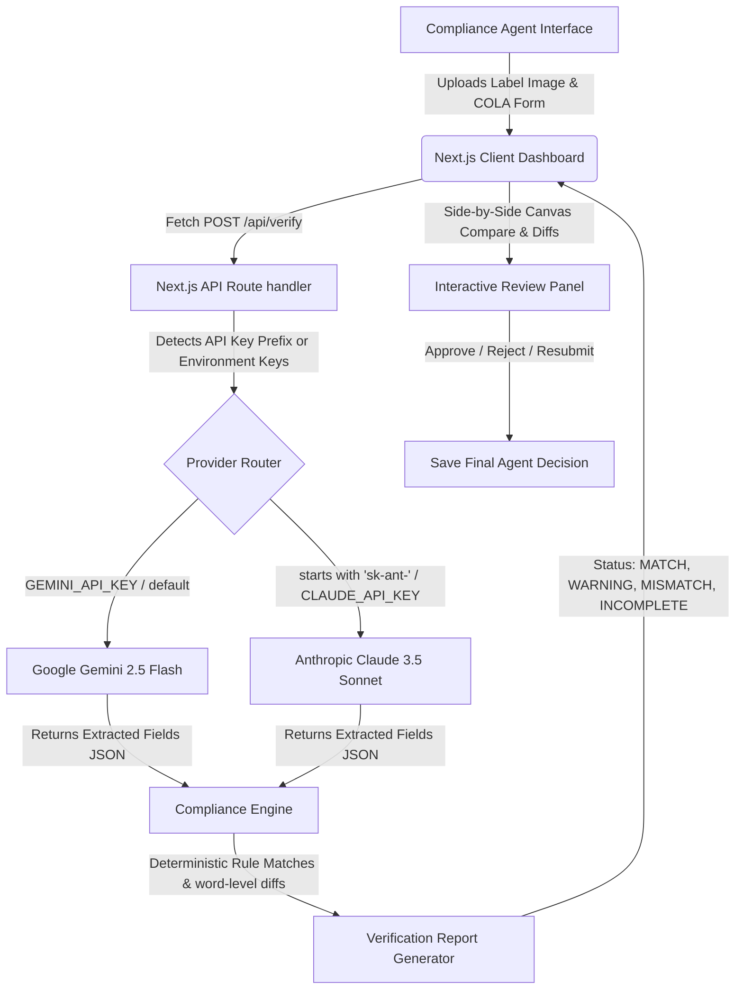

# AI-Powered Alcohol Label Verification Portal (TTB Compliance Prototype)

An interactive, serverless prototype designed for TTB (Alcohol and Tobacco Tax and Trade Bureau) compliance agents to automate label verification against COLA (Certification/Exemption of Label/Bottle Approval) applications. 

This standalone proof-of-concept leverages **Google Gemini 2.5 Flash** or **Anthropic Claude 3.5 Sonnet** for high-fidelity visual OCR text extraction, paired with a deterministic Javascript verification engine for legal rule matching.

---

## 1. Technical Architecture & System Flow

The diagram below demonstrates how data flows from the user interface, through the Next.js backend, routes to the corresponding LLM provider, and processes audits inside the custom compliance rules engine:



---

## 2. Setup & Installation

### Prerequisites
*   [Node.js](https://nodejs.org/) (v18.x or v20.x recommended)
*   An active **Google Gemini API Key** or **Anthropic Claude API Key**

### Local Run Steps
1.  **Clone or Open the Repository**:
    Navigate to the project directory:
    ```bash
    cd Treasurytakehome-rgb/label-verification
    ```

2.  **Install Dependencies**:
    ```bash
    npm install
    ```

3.  **Configure Environment Variables**:
    Create a `.env.local` file inside the `label-verification/` directory:
    ```bash
    cp .env.example .env.local
    ```
    Open `.env.local` and fill in **one** key. The provider is chosen by which key is present:
    ```env
    GEMINI_API_KEY=AIza...      # Gemini (default) — get one at https://aistudio.google.com/apikey
    # OR
    CLAUDE_API_KEY=sk-ant-...   # Claude
    ```
    > ⚠️ **Set only one key.** If `CLAUDE_API_KEY` (or `ANTHROPIC_API_KEY`) is present, the app routes
    > **all** requests to Claude — so leave the Claude line commented out when using Gemini. The shipped
    > `.env.example` keeps Claude commented for this reason.

4.  **Start the Server**:
    ```bash
    npm run dev
    ```
    Open your browser and navigate to **[http://localhost:3000](http://localhost:3000)**.

---

## 3. Environment Variables Configuration

The application is built to be highly flexible. You can provide your API keys in two different ways:

1.  **Server-Side Environment File (`.env.local`)**:
    *   Set `GEMINI_API_KEY` (starts with `AIzaSy...`) OR `CLAUDE_API_KEY` (starts with `sk-ant-...`) inside `label-verification/.env.local`.
    *   When the user runs verification, the backend automatically uses these keys.
2.  **Client-Side UI Settings Panel**:
    *   Paste your key directly into the **API Settings** input field in the browser UI and click **Save Key**.
    *   The key is stored in your browser's local cache (`localStorage`) and overrides server environment variables for quick debugging.

---

## 4. Tools & Libraries Used

| Layer | Tool / Library | Purpose |
|-------|----------------|---------|
| Language | **TypeScript 5** | Type-safe app + API in one codebase |
| Framework | **Next.js 15** (App Router) + **React 19** | UI and serverless `/api/verify` route |
| AI / OCR | **Google Gemini 2.5 Flash** via `@google/generative-ai` | Multimodal field extraction from label images |
| AI / OCR (alt) | **Anthropic Claude 3.5 Sonnet** via REST `fetch` | Drop-in alternate provider |
| Compliance logic | **Custom TypeScript engine** (`src/lib/verifier.ts`) | Deterministic rule matching + LCS word diff |
| Icons | **lucide-react** | Interface iconography |
| Styling | **CSS custom properties** + inline styles (Tailwind v4 imported) | Glassmorphism design system, high-contrast a11y |
| Tooling | **Node.js**, **npm**, **ESLint 9** | Build, dependency, and lint tooling |
| Test labels | AI image generation / scripted PNGs | Synthetic compliant & non-compliant samples |

## 5. Current Status & Verification Summary

The **core single-label verification pipeline is complete and has been verified end-to-end against the live Gemini API.** See [`checklist.md`](./checklist.md) for the full breakdown and [`design_decisions.md`](./design_decisions.md) for known limitations.

### **Completed & verified:**
*   **API Verification Route**: Routes to Google Gemini 2.5 Flash (default) or Anthropic Claude 3.5 Sonnet, with deterministic (`temperature: 0`) extraction from base64 images.
*   **Single Label Verification Dashboard**: Visual HTML5 comparative canvas, real-time label text editing, word-level Longest Common Subsequence (LCS) diff viewer, and an Agent Decision panel.
*   **Compliance Rules Engine**: Custom ABV regex parsing (percentage and proof conversion), net contents spacing tolerance, brand matching, and strict word-for-word + ALL-CAPS casing checks for the Surgeon General warning. Reports four statuses: `MATCH`, `WARNING`, `MISMATCH`, and **`INCOMPLETE`** (when a COLA form field is left blank — surfaces what the AI read instead of producing a misleading mismatch).
*   **Accessibility (a11y) Focus**: High-contrast `:focus-visible` indicators across interactive elements for keyboard-only navigability (the 50+ agent demographic).

### **Built, pending end-to-end verification:**
*   **Batch Verification Dashboard**: Custom multi-image uploader + CSV mapper, client-side parallel queue (1–3 workers), progress/stats, missing-file diagnostics, and a "Download CSV Template" option. *(UI and queue logic complete; full multi-label live run still being validated.)*
*   **Imperfect-image handling** (angle/glare/lighting) relies on the multimodal model and has not been formally benchmarked.

---

## 6. Production Deployment Guide

Since this Next.js app is built on App Router and uses serverless API routes, it can be deployed to standard cloud platforms.

> **Important deploy notes**
> - **Root Directory**: the Next.js app lives in `label-verification/`, *not* the repo root. Set the platform's "Root Directory" to `label-verification` or the build will fail.
> - **One key only**: set **`GEMINI_API_KEY`** (and *not* `CLAUDE_API_KEY`) unless you intend to use Claude — see the routing note in §2.
> - **Quota**: Gemini's free tier rate-limits image requests; under demo load you may see `429`/`503`. Enable billing for sustained throughput.

### Option A: Vercel (Recommended)
1. Push this repository to GitHub.
2. In the Vercel dashboard, "Add New Project" → import the repo.
3. **Set "Root Directory" to `label-verification`.**
4. Add the Environment Variable **`GEMINI_API_KEY`** (Production + Preview).
5. Deploy. (CLI alternative: `npm i -g vercel`, then `vercel` / `vercel --prod` run from inside `label-verification/`.)

### Option B: Firebase App Hosting
Firebase App Hosting automatically builds and manages your Next.js application backend.
1. Initialize Firebase: `npx firebase-tools init apphosting` (run inside `label-verification/`).
2. Select your Firebase project and name your web app.
3. Configure your API secret keys in GCP Secret Manager and map them in your `apphosting.yaml` configuration file:
   ```yaml
   env:
     - variable: GEMINI_API_KEY
       secret: GEMINI_API_KEY_SECRET
   ```
4. Commit and push your code to GitHub; Firebase App Hosting will automatically trigger a rolling deployment.

### Option C: Azure App Service (NodeJS Linux)
Since the production COLA and agency infrastructure is Azure-based (as noted by Marcus), deploying to Azure App Service is a natural staging solution:
1. Initialize Azure CLI and login: `az login`
2. Create an App Service Plan and Web App:
   ```bash
   az webapp up --name ttb-compliance-portal --resource-group ttb-rg --plan ttb-plan --runtime "NODE|20-lts"
   ```
3. Set app settings for API keys:
   ```bash
   az webapp config appsettings set --name ttb-compliance-portal --resource-group ttb-rg --settings GEMINI_API_KEY="AIza..." CLAUDE_API_KEY="sk-ant-..."
   ```
4. Azure will build the application using Oryx and run the production server.
