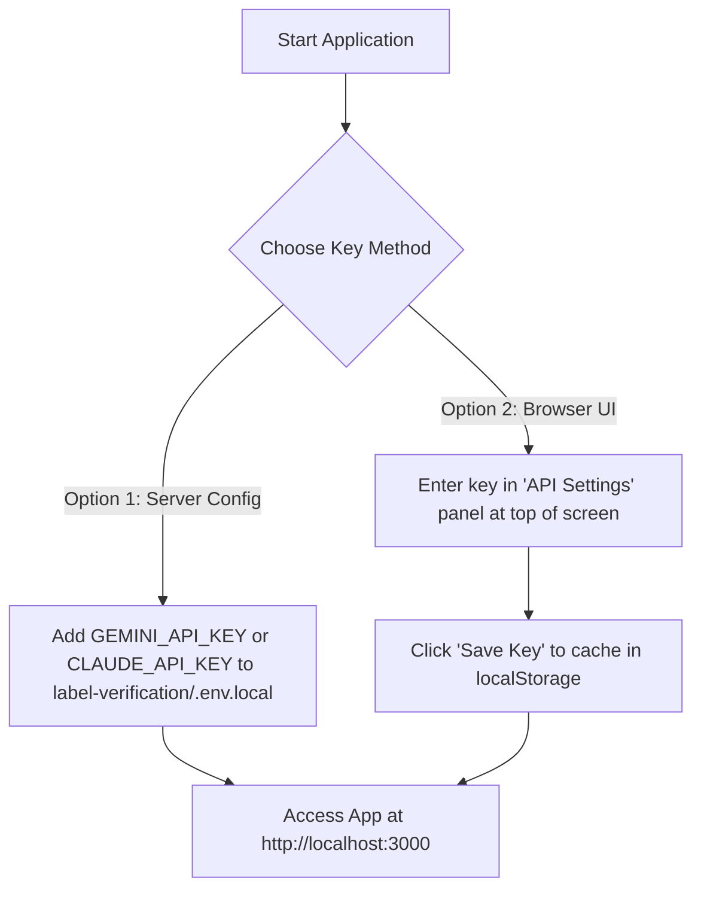
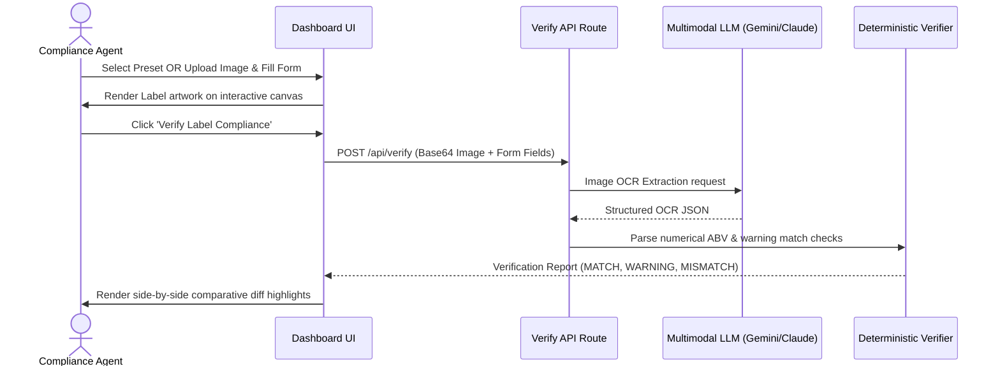
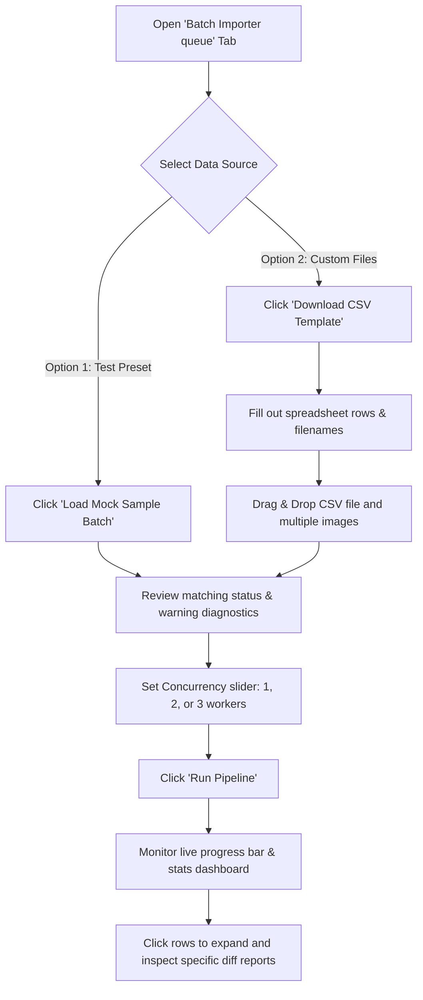
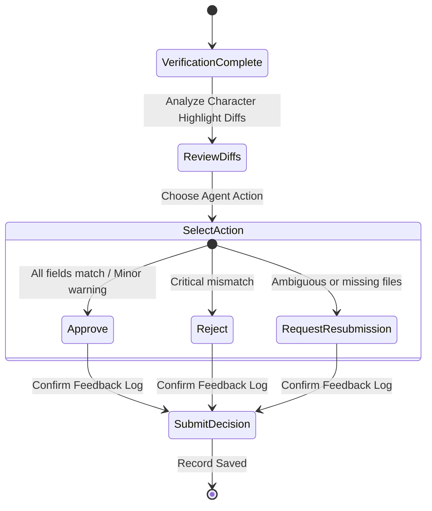

# User Guide: TTB Alcohol Label Verification Portal

This guide provides step-by-step instructions on how to use the portal to verify alcohol beverage labels for regulatory compliance. It includes interactive diagrams outlining the data and action flows for each stage.

---

## Step 1: Authentication & Setup

Before verifying labels, you must supply an API key for the compliance engines (Google Gemini or Anthropic Claude).

1. Open your browser and navigate to **[http://localhost:3000](http://localhost:3000)**.
2. Locate the **API Settings** panel at the top of the dashboard.
3. Enter your **Gemini Key** (starts with `AIzaSy...`) or **Claude Key** (starts with `sk-ant-...`) and click **Save Key**. 
4. *Alternatively*, create a `.env.local` file inside `label-verification/` and define your keys (e.g. `CLAUDE_API_KEY=your_key_here`).

---

## Step 2: Single Label Verification

Audit a single label artwork against a registry application.

### **Testing with Presets (Quick Setup):**
1. Ensure the **Single Application Review** tab is active.
2. Select any preset button at the top (e.g. **OLD TOM**, **STONE'S THROW**, **HIGHLAND MIST**).
3. The application will auto-fill the reference form and draw a mock label onto the interactive canvas.
4. Click the **Verify Label Compliance** button. The comparative results appear in under 2 seconds.
5. *Tip:* Modify details in the **Interactive Label Canvas Editor** or the **COLA Form** to simulate spelling typos and casing warnings on the fly.

### **Testing with Custom Files:**
1. Drop a PNG or JPEG file into the **Label Artwork** upload box.
2. Manually enter the expected registry parameters in the form on the left.
3. Click **Verify Label Compliance** to audit.

---

## Step 3: Batch Queue Importer

Audit multiple label applications concurrently during high-volume periods.

1. Navigate to the **Batch Importer queue** tab at the top of the portal.
2. **Download Template**: Click **Download CSV Template** to format your data correctly.
3. **Upload CSV**: Drop your completed CSV application file into the right-hand uploader.
4. **Upload Artwork**: Drag and drop all corresponding label images (matching filenames in the CSV) into the left-hand uploader.
5. **Inspect Matching**: Read the **Application Matching Diagnostics** box to ensure there are no mismatched filenames.
6. **Set Workers & Run**: Adjust the Concurrency selector (1, 2, or 3 parallel workers) and click **Run Pipeline**.
7. **Expand Details**: Monitor queue progress cards. Click any completed row to slide open the side-by-side verification report.

---

## Step 4: Finalizing Review Decisions

Submit decisions and log audit notes.

1. Once verification completes, review the side-by-side diff highlights (emerald green for matching, amber yellow for warnings, rose red for critical mismatches).
2. Look at the **Agent Action Panel** at the bottom of the column.
3. Select **Approve**, **Reject**, or **Request Resubmission**.
4. The system will pre-generate professional feedback log entries detailing the exact reason for rejection or warnings. Modify these notes if desired and click **Submit Final Decision**.
